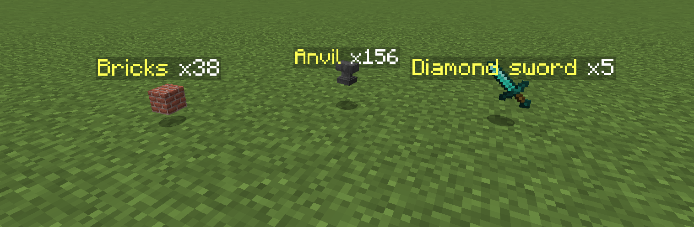
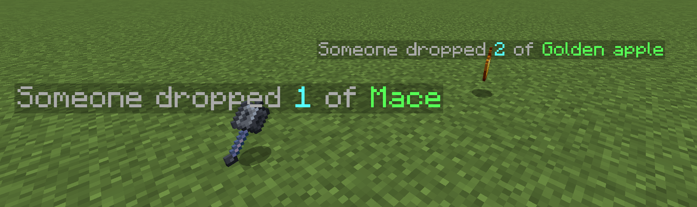
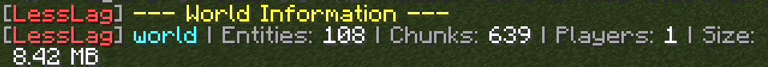
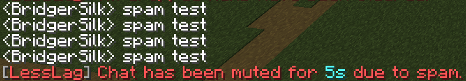
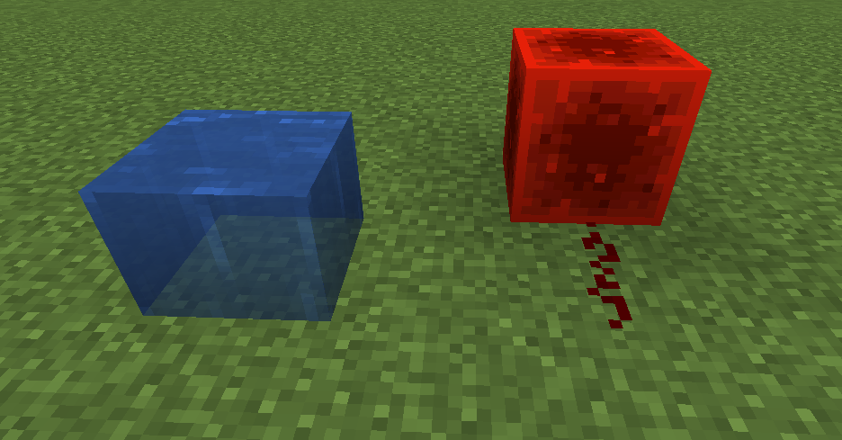
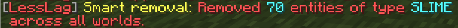
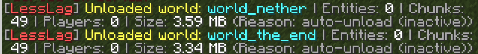

<h1 align="center"> LessLag</h1>

  LessLag is a <b>performance optimization</b> plugin for Minecraft servers that <b>reduces lag automatically</b> by controlling worlds, entities, redstone, mob AI, and much more. Designed to keep TPS high without sacrificing gameplay.

  
  
  
  

---

## 💡 About

LessLag dynamically monitors server performance and automatically disables or throttles **lag-inducing features**.
From unloading inactive worlds to merging dropped items, disabling redstone during TPS drops, and controlling entity AI—LessLag **keeps your server smooth** with minimal change of vanilla features.

---

## ✨ Key Features

* ⚙️ **Fully Customizable** – Every feature can be customized in the config (`plugins/LessLag/config.yml`)
* 🗺 **World Management** – Unload inactive worlds automatically
* 🧹 **Item & Entity Control** – Auto-clear dropped items, stack drops, cap entities per world and per chunk
* 🚷 **Player Protection** – Kick packet spammers, block teleportation when TPS are low, anti-chat spam
* 🔌 **Redstone Optimization** – Disable redstone, fluids, explosions, falling blocks
* 🧠 **Mob AI Optimization** – Freeze mobs when no players nearby
* 🧭 **Chunk Loading Control** – Prevent mass chunk load during lag spikes
* 📊 **Performance Profiler** – Real-time TPS, MSPT, CPU, RAM, player ping tracking
* ⚡ **Smart TPS Handling** – Auto-disable heavy operations when TPS drops

---

## 📂 Commands

| Command            | Description                    |
| ------------------ | ------------------------------ |
| `/lesslag` / `/ll` | Main command                   |
| `/ll reload`       | Reloads configuration          |
| `/ll info`         | Shows plugin info              |
| `/ll profiler`     | Toggles performance profiler   |
| `/ll worlds`       | Lists loaded worlds with stats |

---

## 🔑 Permissions

| Permission         | Description                    |
| ------------------ | ------------------------------ |
| `lesslag.admin`    | Access `/ll` command & get notified about performance related data |

---

## ✨ Showcase

  

<b>Improved item stacking, also works with un-stackable items, no item amount limit

 

  

Everything is customizable, even the item stack holograms

 

  

Performance Profiler

 

  

World list command <code>/ll worlds</code>

 

  

Anti chat spam

 

  

Disable Fluids, Redstone and more when TPS are low

 

  

Auto-clear dropped items

 

  

Smart entity removal

 

  

Auto-unload inactive worlds
</b>

---

## 🔗 Downloads

* [SpigotMC](https://www.spigotmc.org/resources/lesslag.127762/)
* [Hangar](https://hangar.papermc.io/BridgerSilk/LessLag)
* [Modrinth](https://modrinth.com/plugin/lesslag)
* [CurseForge](soon)
* [Bukkit](soon)

---

## 📌 Latest Update

**Version:** `v0.0.3`

* ✅ added bStats

---

## ⚙️ Requirements

* Minecraft 1.16+
* Java 17 or higher
* Paper / Spigot server *(or forks of those)*
* [Protocol Lib](https://ci.dmulloy2.net/job/ProtocolLib/lastStableBuild/)

---

## 🤝 Contribute

We welcome contributions!

1. Fork the repository
2. Create a feature branch (`feature/my-feature`)
3. Commit changes
4. Open a Pull Request

---

## ❤️ Donate

If you enjoy LessLag and want to support its development:

* Buy me a coffee with [Ko-fi](https://ko-fi.com/bridgersilk)

---
Have a nice day <3